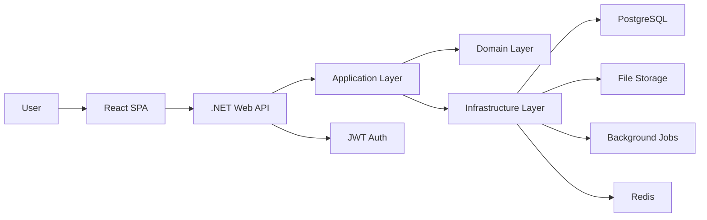
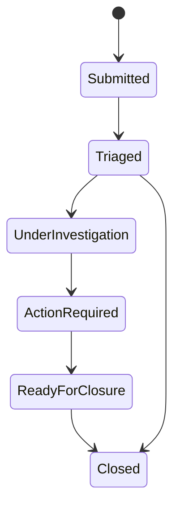
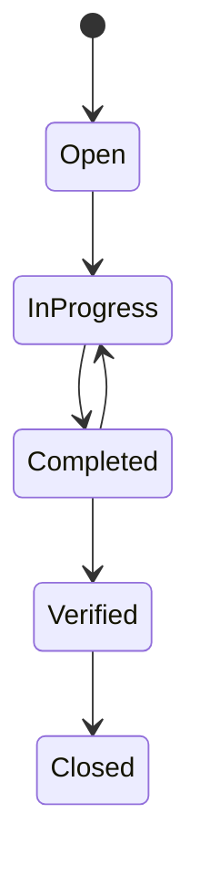
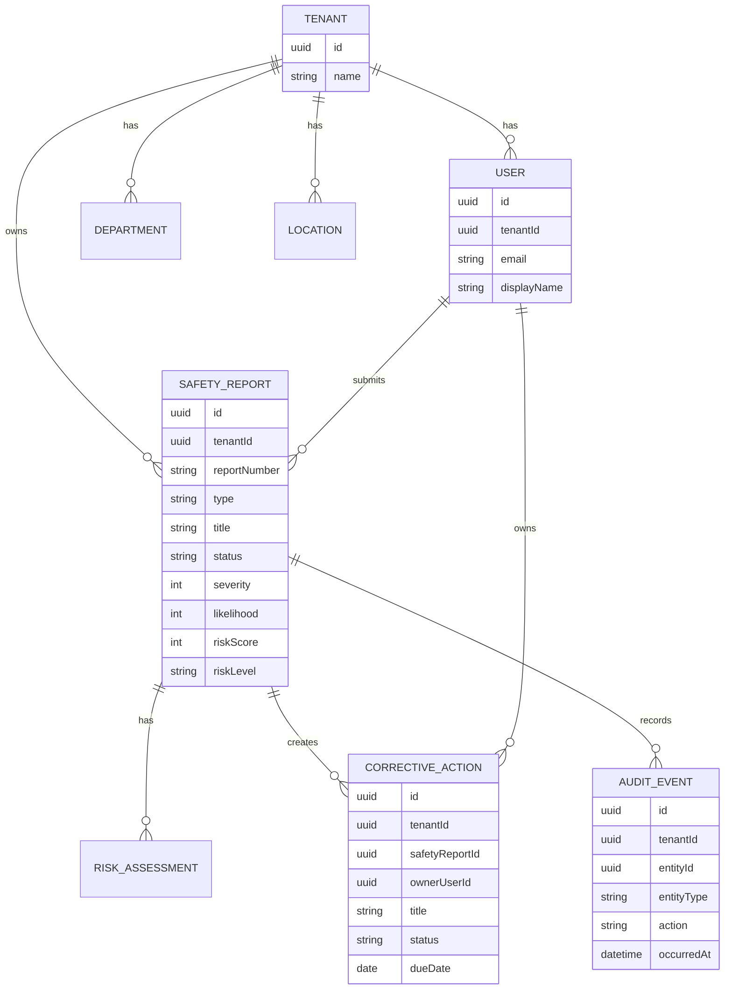

# Architecture Design

## Architecture Goals

SafeSphere SMS should feel like a real enterprise application, even in MVP form.

Primary goals:

- Strong separation between domain, application, infrastructure, and API concerns.
- Tenant-isolated data access from the beginning.
- Secure-by-default authorization checks.
- Auditable workflow changes.
- API design that supports a React SPA and future integrations.
- Clear extension points for background jobs, RAG, MCP, and real-time updates.

## High-Level System



## Backend Structure

The backend should follow Clean Architecture.

```text
backend/
  src/
    SafeSphere.Api/
    SafeSphere.Application/
    SafeSphere.Domain/
    SafeSphere.Infrastructure/
  tests/
    SafeSphere.Application.Tests/
    SafeSphere.Api.Tests/
```

### Domain Layer

Owns business rules and core entities.

Key entities:

- Tenant
- User
- Role
- Permission
- SafetyReport
- RiskAssessment
- CorrectiveAction
- AuditEvent
- Attachment
- Department
- Location

Domain concepts:

- Report status transitions
- Risk score calculation
- CAPA lifecycle
- Audit event creation
- Tenant ownership

### Application Layer

Owns use cases and orchestration.

Patterns:

- Commands and queries
- MediatR handlers
- DTOs/contracts
- Validators
- Authorization policies
- Interfaces for infrastructure services

Example use cases:

- CreateSafetyReportCommand
- GetSafetyReportDetailQuery
- UpdateReportStatusCommand
- CreateCorrectiveActionCommand
- CompleteCorrectiveActionCommand
- GetDashboardSummaryQuery

### Infrastructure Layer

Owns external implementation details.

Responsibilities:

- EF Core DbContext
- PostgreSQL persistence
- Identity/password hashing implementation
- JWT token service
- File storage service
- Audit log persistence
- Background job implementation
- Email/notification implementation later

### API Layer

Owns HTTP transport.

Responsibilities:

- Controllers or minimal API endpoints
- Auth middleware
- Tenant resolution middleware
- Exception handling middleware
- Request/response mapping
- Swagger/OpenAPI
- Health checks

## Frontend Structure

```text
frontend/
  src/
    app/
    features/
      auth/
      dashboard/
      safety-reports/
      risk/
      corrective-actions/
      audit/
    shared/
      api/
      components/
      hooks/
      layout/
      types/
```

Frontend principles:

- Feature-based folder structure.
- Server state through TanStack Query.
- Forms through React Hook Form and Zod.
- Route guards for authenticated pages.
- Permission-aware UI.
- Reusable table, status badge, risk badge, and timeline components.

## Multi-Tenancy

The MVP should use shared database, shared schema multi-tenancy.

Most tenant-owned tables include:

- TenantId
- CreatedAt
- CreatedByUserId
- UpdatedAt
- UpdatedByUserId

Every query for tenant-owned data must filter by TenantId. Authorization should verify both user permission and tenant ownership.

Future option:

- PostgreSQL row-level security.
- Separate schema per tenant.
- Separate database per enterprise tenant.

## Security Model

Authentication:

- JWT access tokens.
- Refresh token rotation.
- Password hashing.
- Current user endpoint.

Authorization:

- Role-based access control for broad behavior.
- Permission-based checks for sensitive operations.
- Tenant isolation for every tenant-owned resource.

Security controls:

- Validate all inputs.
- Use parameterized queries through EF Core.
- Rate limit auth endpoints.
- Never expose stack traces in production.
- Store secrets in environment variables.
- Restrict file upload type and size.
- Audit important business events.

## Core Workflows

### Safety Report Workflow



### CAPA Workflow



### Risk Scoring

Initial MVP formula:

```text
riskScore = severity * likelihood
```

Suggested levels:

- 1-4: Low
- 5-9: Medium
- 10-16: High
- 17-25: Critical

This can later become tenant-configurable.

## Data Model Draft



## Observability

MVP:

- Structured logs with Serilog.
- Request correlation ID.
- Health check endpoint.

Future:

- OpenTelemetry traces.
- Prometheus metrics.
- Grafana dashboards.
- Centralized logs.

## RAG Extension Point

RAG should be added after the core SMS workflows are stable.

Possible capabilities:

- Ask questions over safety policies and SOPs.
- Find similar incidents from historical data.
- Suggest corrective actions from prior verified cases.
- Summarize investigation notes.
- Generate lessons-learned bulletins.

Important design rule:

RAG retrieval must be tenant-aware and permission-aware. A user should only retrieve content they are authorized to access.

## MCP Extension Point

MCP can be introduced as a tool integration layer for the Safety Copilot.

Possible MCP tools:

- Search approved safety documents.
- Create a CAPA ticket in an external system.
- Schedule effectiveness reviews.
- Retrieve tenant dashboard metrics.
- Fetch document metadata from approved storage.

The first version should document MCP as a planned integration, not implement it.

